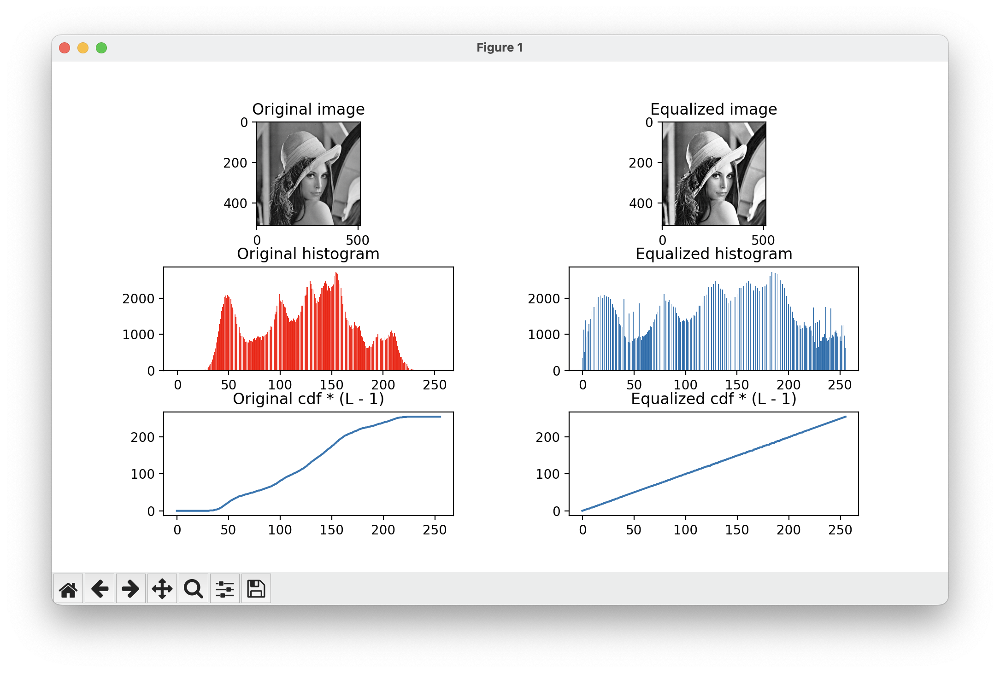
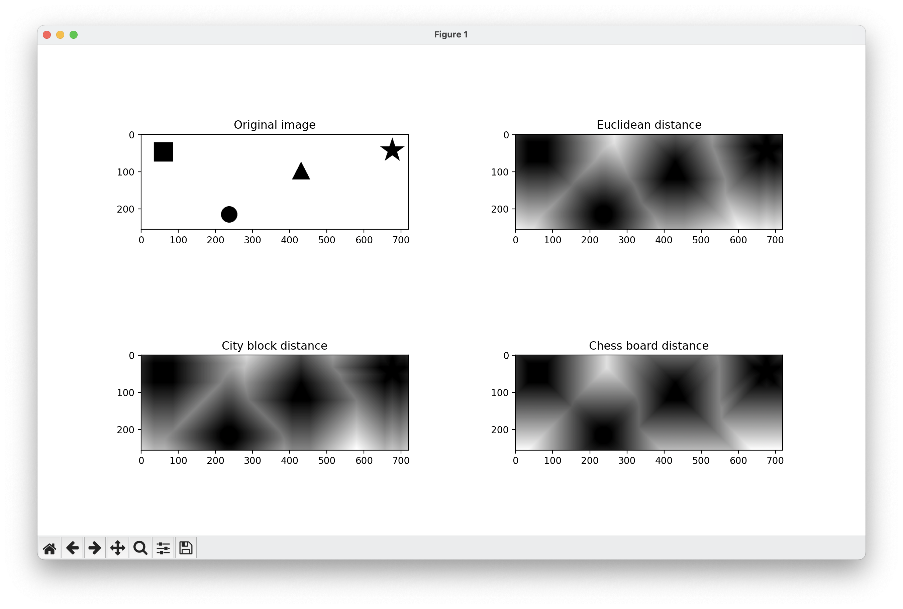

# CV Assignments

This repository contains the source code and results for CV assignments.

## Histogram Equalization

Histogram equalization is a technique for adjusting image intensities to enhance contrast. The process involves spreading out the most frequent intensity values.

### Result

## Distance Transformation

Distance transformation converts a binary image, where the foreground is the object of interest and the background is the rest, into an image where each pixel's value is the distance to the nearest object boundary.

### Result

